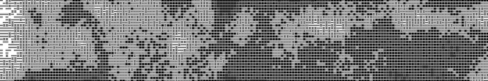

  

###

<h1 align="left">Olá 👋, eu sou André!</h1>

###

  
  
  
  

###

Hello World!!

###

<h3 align="left">Um pouco sobre mim:</h3>

###

🌱 _ Atualmente aprendendo Java e Banco de Dados; 💻 _ Em busca de uma oportunidade na área de desenvolvimento de software; 📚 _ Mais de 5 anos de experiência em design (Graduado desde 2022); 📠_ Confira o meu currículo; 💀 _ Qualquer coisa pode me chamar em uma das plataformas disponíveis; 👾 _ Amo games (principalmente RPG's), livros (clássicos e de ficção científica), filmes (suspense e animações), e também tenho uma gata chamada Elza Soares ğŸˆâ€â¬› 

###
###

<h3 align="left">Linguagens e Ferramentas</h3>

###

  
  
  
  
  
  
  
  
  
  
  
  
  
  
  
  
  
  
  

###

<h3 align="left">Meus status no GitHub</h3>

###

  
  

###
